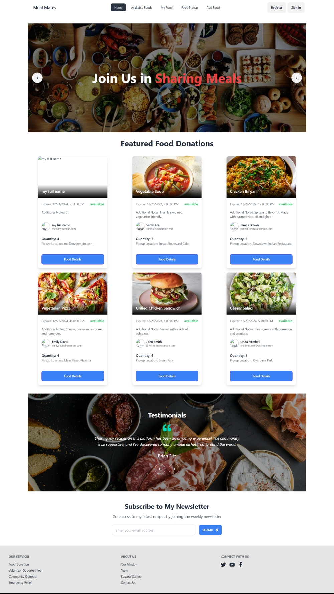

# **MealMates Client**

## **Purpose**
MealMates is a web application that simplifies food donation and management. It allows donors to contribute food and enables organizations to manage these donations effectively.

---

## **Live URL**
https://mealmeats.web.app/
---

## **Live Preview**

## **Key Features**
1. **Authentication and Authorization:**
   - Firebase Authentication for user login (Email/Password and Google).
   - JWT-based secure access for protected routes.

2. **Donation Management:**
   - Add, view, update, and manage food donation requests.
   - Real-time updates for requests and statuses.

3. **Dynamic Routing:**
   - Pages such as `My Foods`, `Add Food`, and `Food Details` are accessible via `react-router-dom` with `PrivateRoute` protection.

4. **Responsive Design:**
   - TailwindCSS and DaisyUI for a mobile-friendly user experience.

5. **Error Handling:**
   - SweetAlert2 for interactive success and error modals.

6. **State Management:**
   - `@tanstack/react-query` for efficient server-state management.
   - Firebase for global authentication state management.

7. **Custom Hooks:**
   - `useAxiosSecure` for handling secure API requests.
